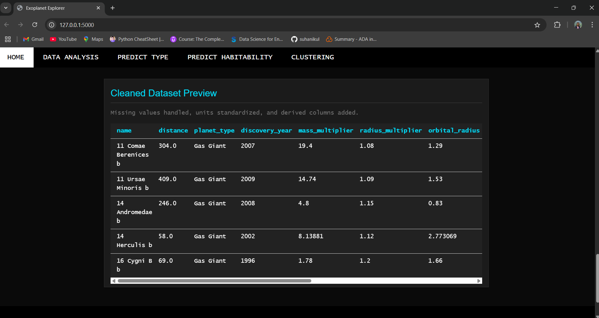

# 🪐 Exoplanet Explorer

An interactive machine learning-powered web app that analyzes and classifies **exoplanets** based on their physical and orbital parameters. Built using **Flask**, this tool enables users to explore exoplanet types, assess habitability, and visualize patterns in astronomical datasets.

## 🌟 Features

- **Exoplanet Type Prediction**: Predicts a planet’s type based on mass, radius, and orbit.
- **Habitability Analysis**: Uses models and rules to assess whether a planet may support life.
- **Clustering Visualization**: Applies K-Means and DBSCAN to find natural groupings in the data.
- **Data Insights**: View discovery trends, feature correlations, and detection methods.
- **Interactive Web UI**: Simple interface built using Flask and Jinja2.
- **Deployed App**: Hosted live using **Render**.

---

## 🗂 Project Structure
```
Exoplanet-Explorer/
├── index.py                ← Flask application entry point
├── app.py                  ← Flask application 
├── requirements.txt        ← Python dependencies
├── README.md               ← Project documentation
├── templates/              ← HTML templates (Jinja2)
├── dataset/                ← Dataset used
├── static/                 ← CSS, images, or JS (if any)
├── screenshots/            ← UI screenshots for README
├── src/                    ← Core logic and ML models
│   ├── data.py             ← Data loading and preprocessing
│   ├── planet_type_model.py     ← Exoplanet classification model
│   └── habitability_model.py   ← Habitability analysis logic
└── .git/                   ← Git version control files
```

---

## 🚀 Live Demo

Visit the app: 👉 **[Exoplanet Explorer on Render](https://exoplanet-explorer-7duy.onrender.com/)**

⚠️ On first load, the app may take a few seconds to spin up due to Render’s free-tier restart policy.

---

## 🛠 Installation Guide

### 1. Clone the Repository

```bash
git clone https://github.com/suhanikul/Exoplanet-Explorer.git
cd Exoplanet-Explorer

### 2. Create a Virtual Environment

```bash
python -m venv venv
```

### 3. Activate the Virtual Environment

- On Windows:
  ```bash
  venv\Scripts\activate
  ```
- On macOS/Linux:
  ```bash
  source venv/bin/activate
  ```

### 4. Install Dependencies

```bash
pip install -r requirements.txt
```

### 5. Set Environment Variables

Create a `.venv` file in the project root:

### 6. Run the Application

```bash
python index.py
```

Visit: [http://127.0.0.1:8000](http://127.0.0.1:8000)

## 🚀 Usage

1. Home: Overview and introduction to the application.
2. Data Analysis: Explore the dataset with interactive visualizations.
3. Predict Type: Input exoplanet parameters to predict its type.
4. Predict Habitability: Assess the potential habitability based on given features.
5. Clustering: View clustering results to identify patterns among exoplanets.

### 🚀 Usage Example

---

### 1. **Predict Exoplanet Type**
- **Input**:
  - Mass: `1.2 Earth units`
  - Radius: `1.5 Earth units`
  - Orbital Period: `5 AU`
- **Output**: `Super-Earth`

---

### 2. **Habitability Analysis**
- **Input**:
  - Mass: `1.2 Earth units`
  - Radius: `1.5 Earth units`
  - Orbital Period: `5 AU`
  - Eccentricity: `0.02`
- **Output**: `Not Habitable`

---

### 3. **Clustering Analysis**
- **Input**: Data for planets' mass, radius, and orbital period.
- **Output**: Clusters of planets with similar characteristics, color-coded for easy visualization.

---

### 4. **Data Analysis & Visualizations**
- **Input**: View correlation heatmaps and discovery trends.
- **Output**: Insights like strong correlations between mass and radius or trends in exoplanet discoveries.

---


## 🔍 Dependencies

- Flask
- scikit-learn
- pandas
- numpy
- matplotlib
- seaborn
- plotly

All required packages are listed in `requirements.txt`.

## 📷 Demo




